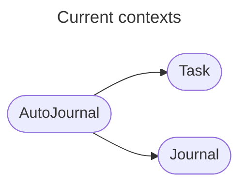

# Contexts

## Overview

Here live the bounded contexts of this solution.

Bounded contexts are typically a host architecture wrapping a clear application and domain model. The application layer should make obvious the use cases the application has, and the interactions it coordinates with the pure domain model.

## Context map

