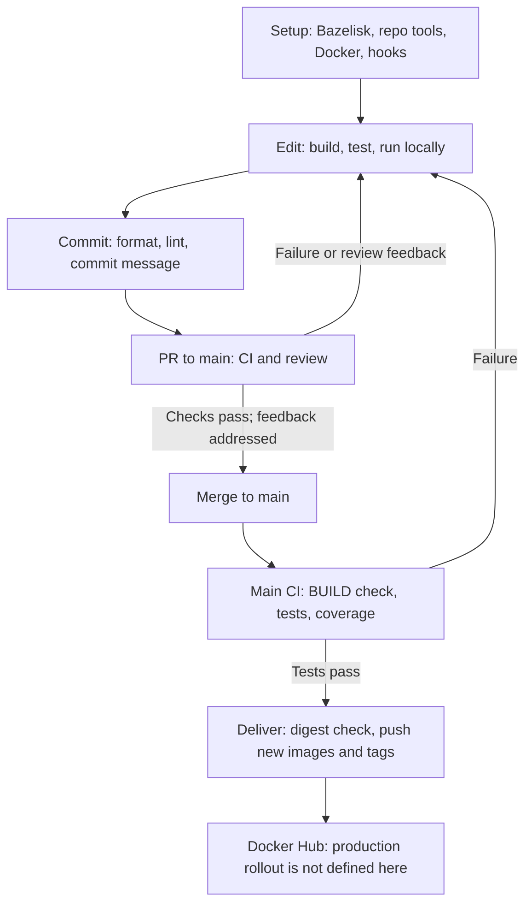

# Development workflow

This is the current path from onboarding to delivered container images. The
short local loop uses pinned tools, incremental builds, and watch targets;
repository-wide checks give feedback before changes reach `main`.

## Setup once

Start with the [getting started guide](../README.md#getting-started) for
Bazelisk, `bazel run tools:bazel_env`, Docker, and the initial build and test.
The [development tools guide](tools.md) explains how direnv exposes the
Bazel-managed tools on `PATH`. Bazelisk selects the repository's Bazel version,
and the repository pins the toolchains and dependencies used by its targets.
Install both commit hooks using [pre-commit setup](pre-commit.md#setup).

Read the project README for local dependencies and configuration before running
it. Keep credentials and real data out of this public repository.

## Keep the local loop short

Run commands from the repository root. Build or test the target being changed
while iterating, then widen validation as described in
[Contributing](../CONTRIBUTING.md#validating-a-change): the whole project for a
project change, or the whole repository for shared code, tools, configuration,
or dependency changes. This checks consumers before review without requiring a
full repository run after every edit.

Bazel reuses unchanged action outputs and cached test results. The default
[Bazel configuration](../.bazelrc) also enables a local disk cache. Keep the
checkout's default output base and startup options so that the server and cache
can be reused; see [Bazel outputs](bazel.md#outputs) for logs and cache behavior.
CI uses a [BuildBuddy remote cache and build event service](../.github/workflows/ci.bazelrc).

Choose the run mode from the project guide:

- [Mops](../projects/mops/README.md#getting-started) runs its service and app
  together or separately, with local configuration documented there.
- [Mops App](../projects/mops/app/README.md#development) provides `ibazel`
  watch commands for the app and Vitest, plus a production bundle preview.
  Watching rebuilds changed inputs before Vite or Vitest reloads them.
- [Organizer](../projects/organizer/README.md#getting-started) can build and
  load images before starting the Docker stack, or run with existing images.
  The existing-image path skips builds, so it does not include new source changes.

Use the [testing guidelines](contributing/testing.md) to keep most behavior in
focused unit tests and reserve infrastructure tests for behavior that needs
real wiring. Docker-tagged tests require a running engine. The Docker-free
validation option in [Contributing](../CONTRIBUTING.md#validating-a-change)
omits those tests, and that omission belongs in the PR's validation results.

## Feedback and protection of main

| Stage                 | Feedback                                                                                                        | What it catches                                                                              |
| --------------------- | --------------------------------------------------------------------------------------------------------------- | -------------------------------------------------------------------------------------------- |
| Local build and test  | Compiler/type errors, test failures, and logs under `dist/testlogs`.                                            | Broken targets and behavior in the selected scope.                                           |
| Local run and watch   | Rebuild/reload feedback and observed app or service behavior.                                                   | Runtime and UI problems that tests can miss.                                                 |
| Commit                | [Configured hooks](../.pre-commit-config.yaml) format and lint applicable files; Commitlint checks the message. | Formatting, static analysis, and commit convention errors before pushing.                    |
| PR CI                 | Gazelle diff check, `no-coverage` tests, coverage for the remaining tests, and pre-commit.                      | Stale Java BUILD files, regressions across projects, and repository style failures.          |
| PR reports and review | JUnit check reports, Codecov reports, and reviewer feedback.                                                    | Failed test cases, coverage changes, and design or behavior gaps that automated checks miss. |
| Main CI               | Repeats BUILD, test, and coverage checks after merge.                                                           | Integration failures on the merged revision.                                                 |
| Image delivery        | Registry digest lookup and image push output.                                                                   | Whether an image is already present and whether publishing succeeds.                         |

The [Build workflow](../.github/workflows/main.yml) runs on PRs targeting `main`
and pushes to `main`. Its common job checks Gazelle output before testing all
`no-coverage` targets and running coverage on the remaining tests. JUnit reports
are published even after a test failure; coverage is uploaded to Codecov. The
PR-only job runs pre-commit. A newer revision cancels an older run for the same
PR, so validation should be assessed on the latest revision.

Before merging, follow [the PR process](../CONTRIBUTING.md#pull-requests-and-ci):
record validation, address review feedback, and ensure checks pass. Local hooks,
project validation, repository-wide CI, and review are successive opportunities
to catch issues before they reach the trunk. They do not prove every runtime
scenario, and the workflow file alone does not establish GitHub branch
protection settings. A failure on `main` needs a corrective change through the
same feedback loop.

## Image delivery and versioning

On `main`, the common CI job logs into Docker Hub and runs
[`deliver_changed.sh`](../tools/bazel/deliver_changed.sh) after the BUILD, test,
and coverage steps succeed. It discovers targets tagged `deliverable` and runs
them in parallel with release stamping. PR runs do not publish images.
Dependency submission and the Codecov upload occur after delivery, so an image
may have been pushed even if one of those later steps fails.

The [OCI macro](../tools/bazel/oci/defs.bzl) defines repositories named
`jackvincent/lab-<repo_suffix>` and
[checks each image digest](../tools/bazel/oci/check_then_push.sh) before pushing.
If that digest is already in the registry, it skips the push and new tags. For
a new image, it pushes `latest` and the stamped version tag. Delivery therefore
tracks changed image contents, rather than assigning every image a new tag on
every merge.

The [weekly tag workflow](../.github/workflows/weekly-tag.yaml) creates an ISO
year/week Git tag on the scheduled revision each Monday at 07:00 UTC.
[`output_workspace_status.sh`](../tools/bazel/output_workspace_status.sh)
derives `STABLE_VERSION` from the nearest matching tag, the commit distance,
and the abbreviated Git SHA: `<year>.<week>.<distance>-<sha>`.
The [release configuration](../.bazelrc) enables that stamp for delivery.
Version tags identify the source revision that published an image; `latest`
moves when a new image is pushed.

The implemented delivery path ends at Docker Hub. This repository does not
define a production rollout, promotion, rollback, or production health check
in these workflows. Publishing an image is the available delivery mechanism;
deploying it to a production environment is outside this documented path.
