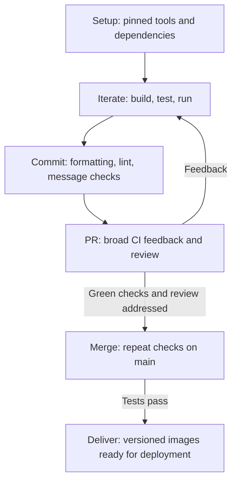

# Developer experience

This monorepo is designed to help humans and agents turn changes into validated,
deployable artifacts with minimal setup, consistent commands, and fast feedback.
The aim is to reduce cognitive load, preserve flow, and make problems visible
while they are still easy to fix.

## Reduce cognitive load

The [setup guide](../README.md#getting-started) establishes Bazelisk, Docker,
and [repository-managed tools](tools.md) in a few commands. Pinned versions
reduce differences between contributors' environments. Bazel resolves declared
build dependencies, so running a target does not require remembering separate
package installation and compilation steps. Project READMEs cover runtime
requirements such as credentials and local infrastructure.

The same interface applies across languages and projects: `bazel build` to
build, `bazel test` to validate, and `bazel run` to start a runnable target.
For example, `bazel run //projects/mops` starts its service and app together.
[Project guides](../README.md#getting-started) name the available targets.
Humans learn the conventions once; agents have fewer commands to discover or
infer when moving between projects.

Shared [contribution conventions](../CONTRIBUTING.md), [agent guidance](../AGENTS.md),
and [repository skills](https://github.com/jackvincentnz/lab/tree/main/.agents/skills) make expectations discoverable and
repeatable.

## Preserve flow

Incremental builds and cached test results reuse unchanged work. The
[local disk cache](../.bazelrc) and [BuildBuddy remote cache in CI](../.github/workflows/ci.bazelrc)
reduce repeated execution, shortening the edit-to-feedback loop. Contributors
can focus on the relevant targets while iterating, then widen validation before
review. [Watch commands](../projects/mops/app/README.md#development) rebuild and
reload the app or rerun tests as sources change.

[Renovate](renovate.md) proposes dependency updates and CI refreshes generated
lockfiles where needed, reducing routine maintenance so contributors can spend
more attention on useful changes.

Artifacts use a [shared source version](../tools/bazel/output_workspace_status.sh),
avoiding separate version bookkeeping for each component. After tests pass on
`main`, [delivery](../tools/bazel/deliver_changed.sh) publishes changed images
with version and `latest` tags, skipping images already present by digest.
These artifacts are ready for deployment; production rollout is outside the
repository's current workflow.

## Make feedback fast and useful

Feedback covers different failure modes at successive stages:

| Stage           | Feedback                                                                                                                          |
| --------------- | --------------------------------------------------------------------------------------------------------------------------------- |
| Local iteration | Compilation, type checks, frontend and backend tests, and observed app behavior.                                                  |
| Commit          | [Formatting, linting, and conventional commit checks](pre-commit.md).                                                             |
| PR and main     | [BUILD consistency, repository-wide tests, JUnit reports, and coverage](../.github/workflows/main.yml), with review before merge. |

Coverage reports show which code tests exercise and where gaps remain. Tests,
coverage, static checks, and review together build confidence in a green check.
The [validation guidance](../CONTRIBUTING.md#validating-a-change) expands checks
to the whole project, or the repository for shared changes, helping catch
regressions in consumers before they reach the trunk. Clear commands and failure
reports help humans and agents use the same correction loop.

A future setup script or guided skill could reduce onboarding to one entry
point; today, the linked setup steps define that path.
