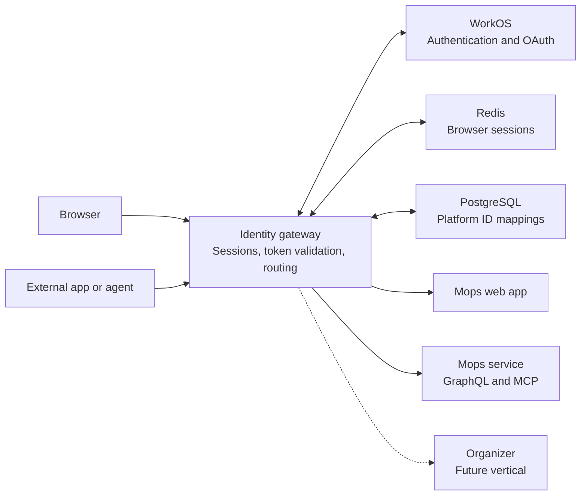
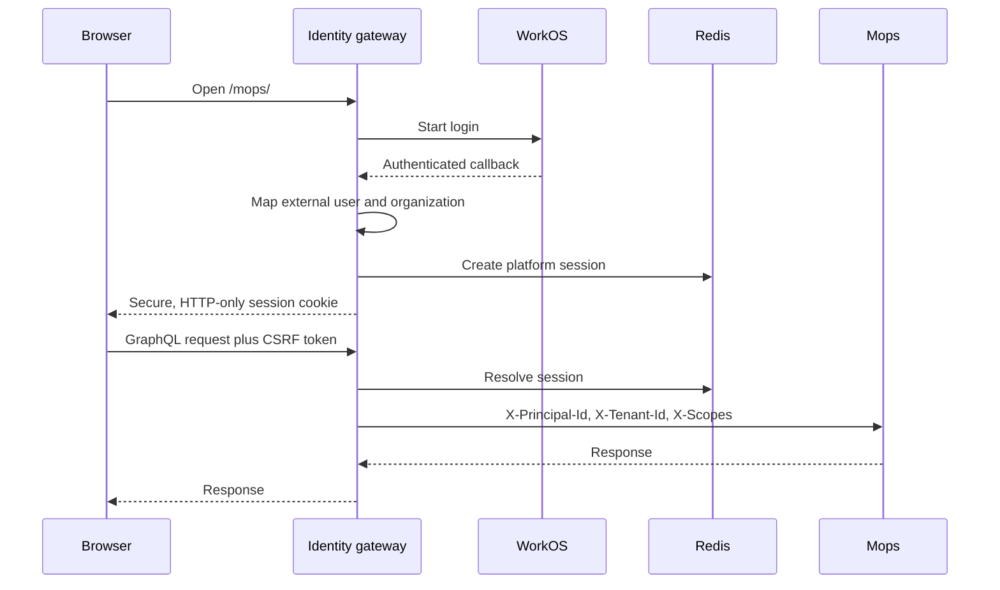
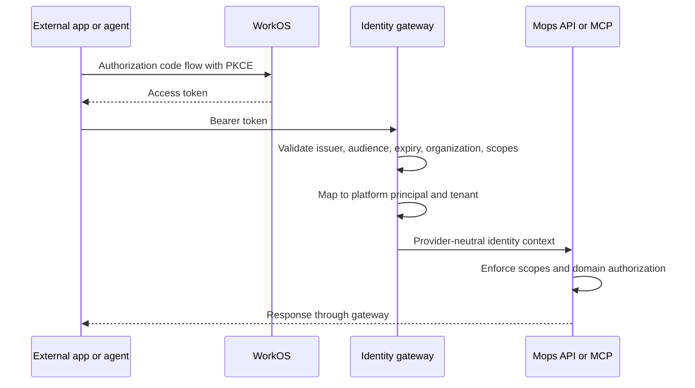
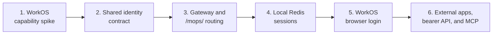

# Identity Gateway

This page summarizes the identity gateway prototype. The detailed decisions and tradeoffs live in
the [prototype ADR](../adr/identity-gateway-prototype.md).

## Goals

The prototype proves that we can:

1. log into Mops in a browser using a server-side session;
2. authorize an external application to call Mops APIs;
3. authenticate public API requests using bearer tokens;
4. authorize an external agent to use the remote Mops MCP server;
5. reuse the identity layer across Mops, Organizer, and future verticals.

The prototype ends when these five flows work. Tenant database lifecycle, profile projections,
membership webhooks, administration, and impersonation are separate future rounds.

## Architecture

The gateway is the only public application entry point. WorkOS proves upstream identity and operates
the initial OAuth authorization server. The gateway maps provider identifiers to stable platform
identifiers and sends only provider-neutral context downstream.

## Ownership

| Concern                                        | Owner                              |
| ---------------------------------------------- | ---------------------------------- |
| Login and upstream authentication              | WorkOS adapter                     |
| OAuth consent and public token issuance        | WorkOS                             |
| Browser session lifecycle                      | Identity gateway and Redis         |
| Stable `principal_id` and `tenant_id` mappings | Identity gateway and PostgreSQL    |
| Public routing and token validation            | Identity gateway                   |
| Mops object and attribute authorization        | Mops                               |
| MCP tools and execution                        | Mops                               |
| Tenant database lifecycle                      | Deferred Mops/control-plane design |

WorkOS-specific IDs and claims stop at the gateway. Mops does not know which identity provider was
used.

## Browser Flow

Browser JavaScript does not receive a bearer token for ordinary Mops requests. The platform session
is shared by verticals on the public origin, but each vertical independently decides what the
principal may do.

## External App And MCP Flow

Each vertical has a distinct OAuth audience and owns the meaning of its scopes. Remote MCP uses the
same bearer-token boundary and the same Mops application authorization as GraphQL.

## Provider Portability

Only WorkOS is implemented in the prototype. Portability is proven through code boundaries:

- provider SDKs, claims, endpoints, and IDs remain inside adapters;
- platform sessions contain platform IDs rather than provider IDs;
- Mops receives the same identity headers regardless of provider;
- switching to Keycloak should require a new adapter, configuration, mapping migration, and OAuth
  client migration, not changes to Mops or session semantics.

The WorkOS capability spike must document actual consent, scope, resource, token-claim, and MCP
behavior before those assumptions become platform contracts.

## Delivery Roadmap

Iteration 4 is the first local end-to-end browser milestone. Iteration 6 completes the prototype.

## Detailed Records

- [Identity gateway prototype ADR](../adr/identity-gateway-prototype.md)
- [Draft: Identity operations](../adr/identity-operations-draft.md)
- [Draft: Mops tenant data lifecycle](../adr/mops-tenant-data-lifecycle-draft.md)
