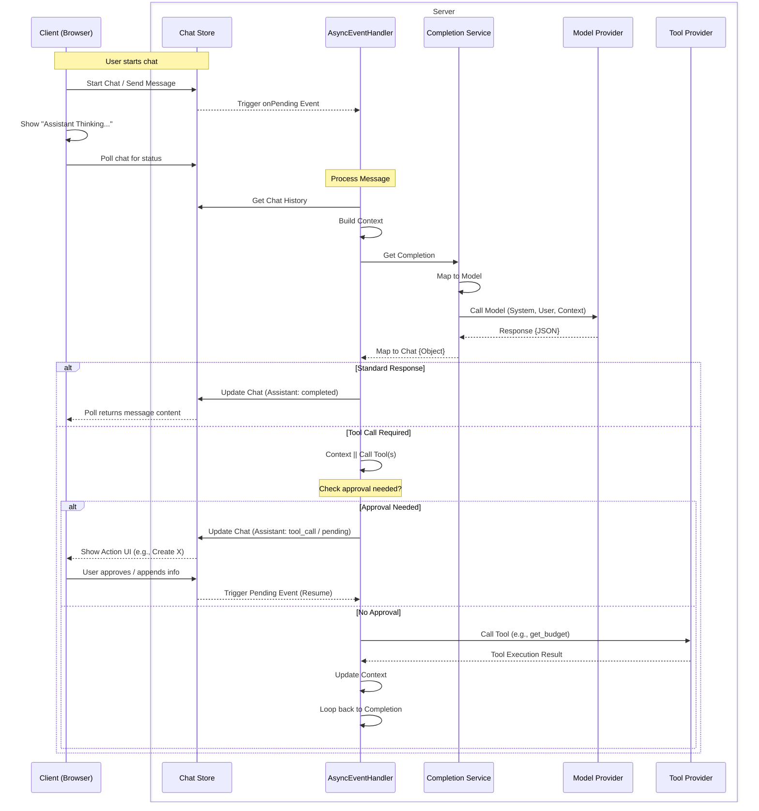

# Agent Overview

```mermaid
sequenceDiagram
    participant C as Client (Browser)
    box Server
        participant Chat as Chat Store
        participant AEH as AsyncEventHandler
        participant CS as Completion Service
        participant MP as Model Provider
        participant TP as Tool Provider
    end

    Note over C, Chat: User starts chat
    C->>Chat: Start Chat / Send Message
    Chat-->>AEH: Trigger onPending Event

    C->>C: Show "Assistant Thinking..."
    C->>Chat: Poll chat for status

    Note over AEH: Process Message
    AEH->>Chat: Get Chat History
    AEH->>AEH: Build Context

    AEH->>CS: Get Completion
    CS->>CS: Map to Model
    CS->>MP: Call Model (System, User, Context)
    MP-->>CS: Response {JSON}
    CS-->>AEH: Map to Chat {Object}

    alt Standard Response
        AEH->>Chat: Update Chat (Assistant: completed)
        Chat-->>C: Poll returns message content
    else Tool Call Required
        AEH->>AEH: Context || Call Tool(s)

        Note over AEH: Check approval needed?
        alt Approval Needed
            AEH->>Chat: Update Chat (Assistant: tool_call / pending)
            Chat-->>C: Show Action UI (e.g., Create X)
            C->>Chat: User approves / appends info
            Chat-->>AEH: Trigger Pending Event (Resume)
        else No Approval
            AEH->>TP: Call Tool (e.g., get_budget)
            TP-->>AEH: Tool Execution Result
            AEH->>AEH: Update Context
            AEH->>AEH: Loop back to Completion
        end
    end
```
