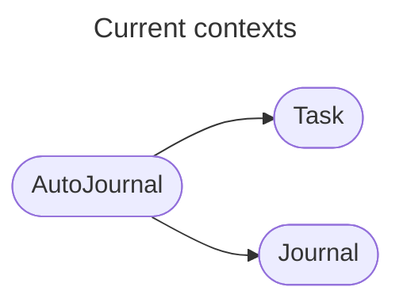

# Services

## Overview

This directory contains the services running within the solution. Services are typically written in a domain driven way, but sometimes a simple service is all that is required.

When services are written in a domain driven manner, you will find bounded contexts that are typically a host architecture wrapping a clear application and domain model. The application layer should make obvious the use cases the application has, and the interactions it coordinates with the pure domain model.

## Context map

